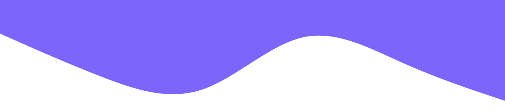

# Hey, I'm Abdul Samad Ansari 👋

I'm a Software Engineer focused on building fast, maintainable web experiences. 
I work across frontend product development with React, TypeScript, Astro, and modern backend systems.

## What I work with

**Frontend:** React · TypeScript · JavaScript · Astro · Tailwind CSS
**Backend:** Node.js · Express · PostgreSQL · MongoDB
**Tools:** Git · Docker · CI/CD

I care about clear systems, thoughtful interfaces, and code that stays maintainable as products grow.

## Connect

